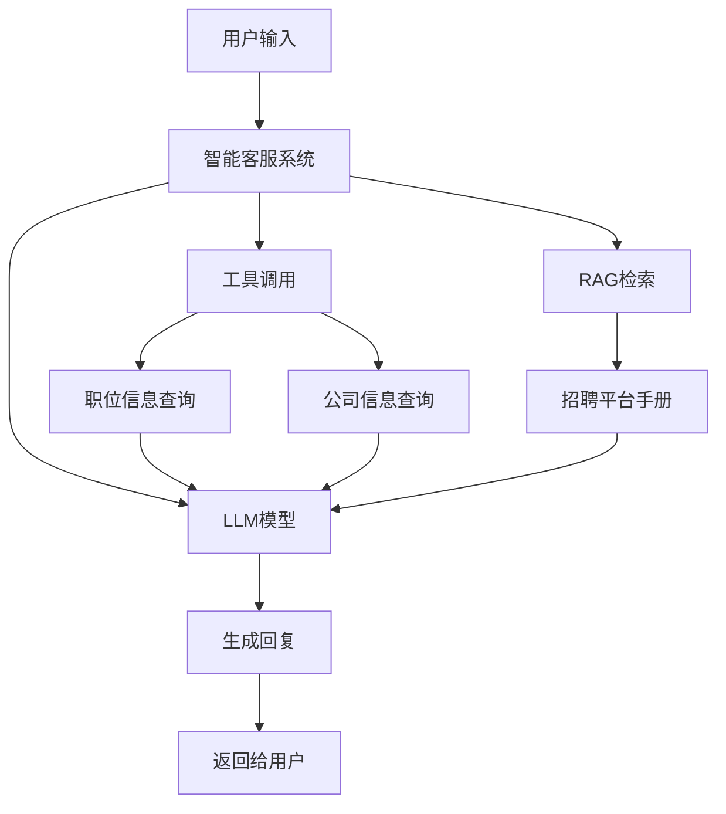
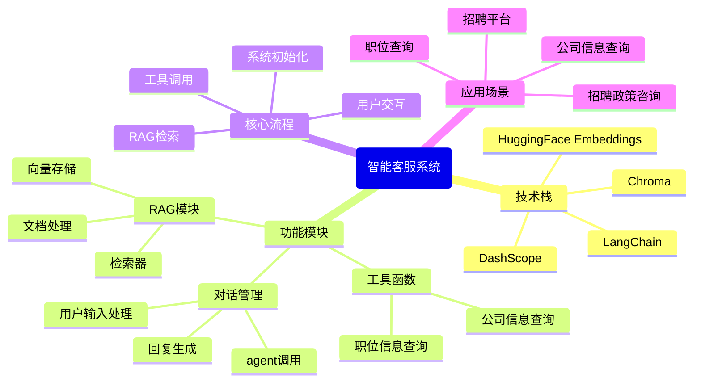

## 项目概述

本项目使用LangChain框架搭建了一个智能客服系统，专门用于招聘平台场景。系统集成了多种高级特性，包括大语言模型(LLM)、函数工具(Function Tool)、检索增强生成(RAG)等，为用户提供专业、准确的招聘相关信息和服务。

### 项目目标

- 构建一个基于LangChain的智能客服系统
- 集成多种高级特性，包括LLM、Function Tool、RAG等
- 适应招聘平台场景，提供专业的招聘相关服务
- 实现智能问答、信息检索、工具调用等功能

## 技术栈分析

| 技术/框架                  | 版本      | 用途                  | 来源    |
| ---------------------- | ------- | ------------------- | ----- |
| Python                 | 3.12    | 编程语言                | 系统环境  |
| LangChain              | 1.2.13  | 构建LLM应用的框架          | pip安装 |
| LangChain Community    | 0.4.1   | 提供社区集成的组件           | pip安装 |
| DashScope              | 1.25.15 | 调用通义千问模型            | pip安装 |
| Chroma                 | 1.5.5   | 向量存储库               | pip安装 |
| HuggingFace Embeddings | -       | 文本嵌入模型              | pip安装 |
| Sentence-Transformers  | 5.3.0   | sentence embeddings | pip安装 |

## 项目流程

### 系统架构



### 核心流程

1. **系统初始化**
   - 加载环境变量
   - 创建示例文档（招聘平台使用指南）
   - 加载文档并分割成文本块
   - 初始化嵌入模型
   - 创建向量存储和检索器
2. **用户交互**
   - 接收用户输入
   - 调用agent处理用户请求
   - 根据需要调用工具（职位信息查询、公司信息查询、招聘平台信息检索）
   - 生成回复并返回给用户
3. **工具调用流程**
   - agent分析用户请求
   - 选择合适的工具
   - 执行工具并获取结果
   - 将结果整合到回复中
4. **RAG流程**
   - 接收用户查询
   - 使用检索器从文档中检索相关信息
   - 将检索到的信息与用户查询一起发送给LLM
   - LLM基于检索到的信息生成回复

## 功能模块

### 工具函数模块

- **职位信息查询**：根据职位ID查询职位详细信息，包括职位名称、薪资范围和工作地点
- **公司信息查询**：根据公司ID查询公司详细信息，包括公司名称、规模和行业
- **招聘平台信息检索**：根据用户查询从招聘平台手册中检索相关信息

### RAG模块

- **文档处理**：加载和分割招聘平台手册
- **向量存储**：使用Chroma存储文档的向量表示
- **检索器**：根据用户查询检索相关文档片段

### 对话管理模块

- **用户输入处理**：接收和处理用户输入
- **agent调用**：使用LangChain的agent处理用户请求
- **回复生成**：基于LLM生成专业、准确的回复

## 演示效果


### 职位信息查询

**用户输入**：查询职位 J001 的信息

**系统回复**：职位 J001: 软件工程师, 薪资: ¥20000-30000/月, 地点: 北京

### 公司信息查询

**用户输入**：查询公司 C001 的信息

**系统回复**：公司 C001: 科技有限公司, 规模: 500-1000人, 行业: 互联网

### 招聘平台信息检索

**用户输入**：职位发布规则是什么？

**系统回复**：根据招聘平台使用指南，职位发布规则包括：

- 企业发布职位需提供真实有效的公司信息
- 职位描述应清晰、准确，包含职责、要求和薪资范围
- 不得发布虚假职位或违规内容

### 综合查询

**用户输入**：我想了解简历投递流程

**系统回复**：根据招聘平台使用指南，简历投递流程包括：

- 求职者可通过平台直接投递简历
- 企业应在3个工作日内查看并回复
- 平台支持多种简历格式上传

## 思维导图



## 代码结构

### 主要文件

- **lagents.py**：主脚本，包含系统的核心实现
- **recruitment\_platform\_manual.txt**：招聘平台使用指南，用于RAG检索

### 核心代码结构

```python
# 1. 导入依赖
from langchain.agents import create_agent
from langchain_community.chat_models import ChatTongyi
from langchain_community.vectorstores import Chroma
from langchain_community.embeddings import HuggingFaceEmbeddings
from langchain_text_splitters import RecursiveCharacterTextSplitter
from langchain_community.document_loaders import TextLoader
from dotenv import load_dotenv
import os

# 2. 定义工具函数
def get_job_info(job_id: str) -> str:
    # 职位信息查询逻辑

def get_company_info(company_id: str) -> str:
    # 公司信息查询逻辑

# 3. 准备RAG所需的文档
# 创建示例文档
# 加载文档
# 分割文档
# 初始化嵌入模型
# 创建向量存储和检索器

# 4. 定义RAG工具
def retrieve_recruitment_info(query: str) -> str:
    # 检索招聘平台信息逻辑

# 5. 工具列表
tools = [get_job_info, get_company_info, retrieve_recruitment_info]

# 6. 系统提示
SYSTEM_PROMPT = """你是一个专业的招聘平台客服助手..."""

# 7. 创建agent
model = ChatTongyi(model="qwen-max")
agent = create_agent(
    model=model,
    tools=tools,
    system_prompt=SYSTEM_PROMPT
)

# 8. 运行agent
print("智能客服系统已启动，输入'退出'结束对话")
while True:
    user_input = input("用户: ")
    if user_input == "退出":
        break
    result = agent.invoke(
        {"messages": [{"role": "user", "content": user_input}]}
    )
    # 提取并打印客服回复
```

## 总结与展望

### 项目成果

- 成功构建了一个基于LangChain的智能客服系统
- 集成了LLM、Function Tool、RAG等高级特性
- 适应了招聘平台场景，提供专业的招聘相关服务
- 实现了智能问答、信息检索、工具调用等功能
- 系统能够根据用户查询提供准确、全面的回答

### 未来展望

- **功能扩展**：添加更多工具函数，如面试技巧查询、薪资行情查询等
- **性能优化**：优化向量存储和检索性能，提高系统响应速度
- **用户体验**：添加对话历史记录、多轮对话支持等功能
- **部署方案**：将系统部署为Web服务，提供API接口
- **模型优化**：尝试使用不同的LLM模型，优化系统性能和准确性

### 技术亮点

- **模块化设计**：系统采用模块化设计，易于扩展和维护
- **多技术集成**：集成了LLM、Function Tool、RAG等多种技术
- **实时检索**：使用向量存储和检索技术，实现实时信息检索
- **智能工具调用**：agent能够根据用户需求智能选择和调用工具
- **专业领域适配**：针对招聘平台场景进行了专门的优化和适配

## 结论

本项目成功构建了一个基于LangChain的智能客服系统，专门用于招聘平台场景。系统集成了多种高级特性，包括LLM、Function Tool、RAG等，为用户提供专业、准确的招聘相关信息和服务。通过模块化设计和技术集成，系统具有良好的扩展性和可维护性，能够满足招聘平台的各种客服需求。

未来，我们可以通过功能扩展、性能优化、用户体验提升等方式，进一步完善系统，使其成为招聘平台的重要工具，为用户提供更加优质的服务。
